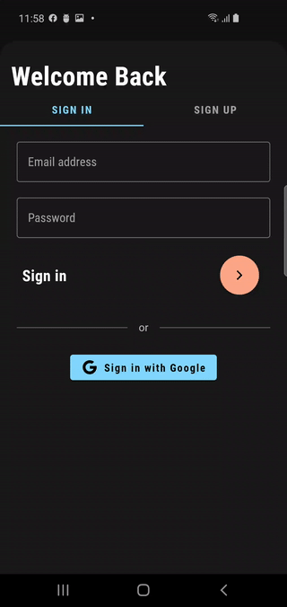
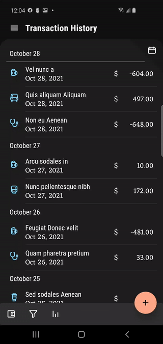
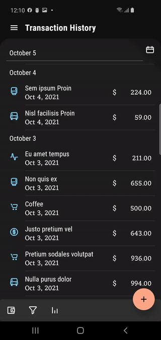
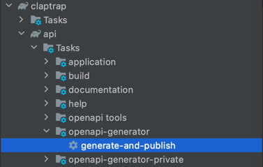
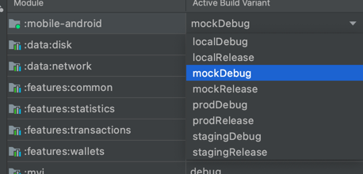

# Money Manager
Application for tracking your expenses so that you don't go unexpectedly broke. When completed,
it's features will include sharing wallets with your friends and family so that you can more easily
collaborate on your expenses.

> But just like any other home project, the primary purpose of this is *learning*

### Technical details:
- Clean Architecture
- Multi-module gradle project
- Multiple product flavours for live and mock versions of the app
- Hand rolled MVI pattern in the presentation layer
- Animations with MotionLayout - handling config changes gracefully
- Documentation first flow with OpenAPI (currently work in progress)
- Shared code between Backend and Frontend applications
- Coroutines and Flows as concurrency solutions
- Android Hilt as DI solution
- Android Navigation Architecture Component for navigation
- OpenID Connect for authentication
- Offloading backend projects from editor
- Project Configuration Plugin for terser gradle scripts for the modules
- `buildSrc`
- Pure Kotlin application

## UI showcase
<table>
<tr>
<td>

</td>
<td></td>
<td></td>
</tr>
<tr>
<td>

</td>
<td>


</td>
</tr>
</table>

## How to build
To build the application first run `./gradlew generate-and-publish` in order to deploy the OpenApi
generated model files to mavenlocal. Or alternatively, you can run the gradle task from the editor
like so:



As the backend code is still a work in progress please select the `mockDebug` product flavour and run the app in the usual way.

## Product flavours
There are multiple flavours for this application
- **mock**: Used for testing without a readily available backend. It uses hardcoded mock data, and won't do any disk or network access. This way UI development can begin before the backend is ready.
- **local**: Used for testing when the backend is running on the local computer (in this case the url is different and we need to enable clear text traffic).
- **prod & staging**: These will hit different environments of the real backend. Of course clear text traffic needs to be disabled in this case, and the base urls will differ.



## Back End
These are very much work in progress. There's a Kotlin + Ktor and a Java + Spring version of them. Currently both of them support logging in. To load them in the editor set the `includeKtor` and `includeSpring` properties in the `gradle.properties` file to `true`
```
includeKtor=true // for Kotlin + Ktor
includeSpring=true // for Java + Spring
```

### Other comments
* As the backend is not ready yet, I did not get the chance to showcase my Retrofit and Room knowledge in this project. For a project showcasing Retrofit and Room usage see: https://github.com/AradiPatrik/fivehour_boilerplate
* Next steps: Fledge out OpenAPI generator, so that I don't have to write retrofit interfaces anymore.
